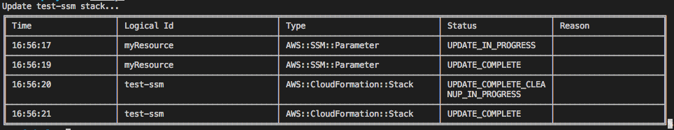
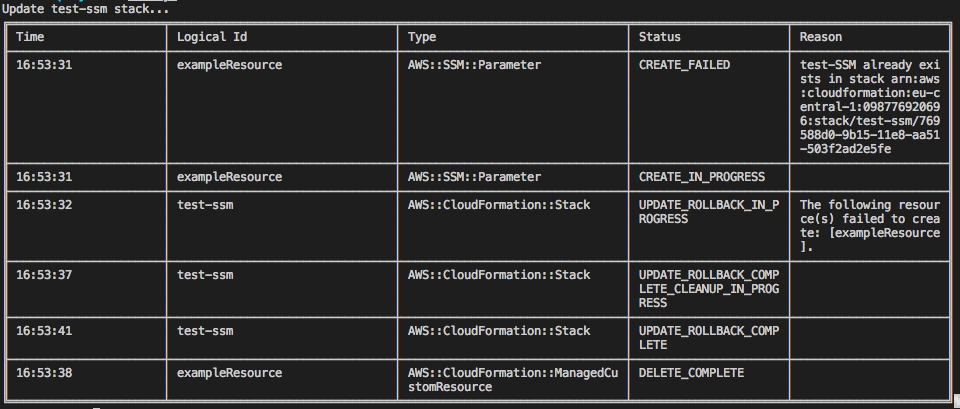

# CloudFormation Fully Deploy

This node module enables you to deploy a cloudformation template and to wait for every resource to be created.

It returns a promise which resolves when the stack's status indicates all resources are deplyed or indicates a deployment error. In case of error, the promise is rejected.

You can install it via npm using `npm install --save-dev cf-wait-deploy`

This module can be used for automated testing and integration.

# Documentation

## Constructor

```javascript
function CloudFormationDeploy(cloudformation, verbose = false, refreshRate = 500);
```

- **cloudformation** : an instanciated CloufFormation object from the AWS SDK
- **verbose** : boolean to indicate verbose mode (see below)
- **refreshRate** : refresh rate in milliseconds for pull CloudFormation events

## Usage Example

You can also use `await waitDeploy(deployParams)`

```javascript
const AWS = require("aws-sdk");

const CloudFormation = new AWS.CloudFormation({ region: "eu-west-1" });

const waitDeploy = require("cf-wait-deploy")(CloudFormation);
const deployParams = require("./deploy-params.js");

waitDeploy(deployParams).then(() =>
  console.log("All resources have been created")
);
```

with a `deploy-params.js` file as follow (this is an example) :

```javascript
{
  "StackName": "myStackName",
  "TemplateBody": JSON.stringify({
      ssmParameterExample: {
        Type: 'AWS::SSM::Parameter',
        Properties: {
            Name: `example-ssm`,
            Type: 'String',
            Value: "this an example resource to deploy"
        }
    }
  })
}
```

# Verbose mode

When activated, verbose mode is powered by the excellent `table` node module and outputs results like so :

- In case of success :
  
- In case of faillure (plus a raised exception) :
  
